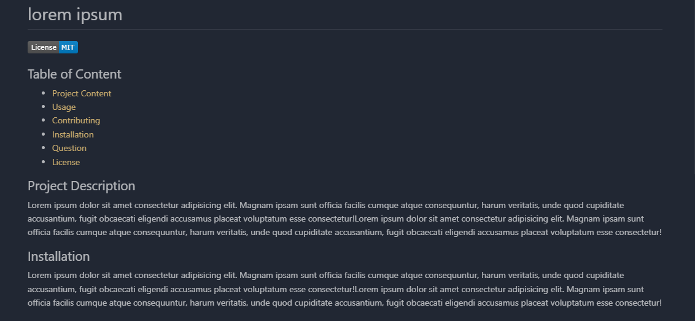
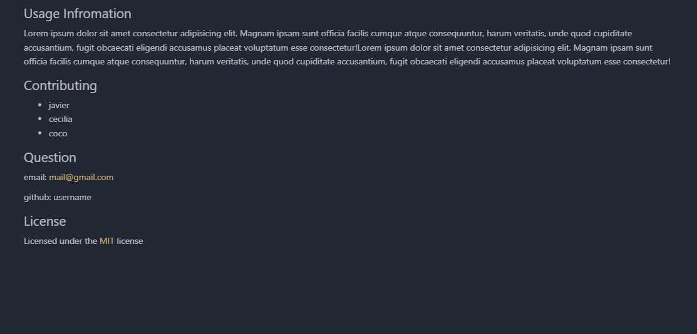

# Readme-Geneartor

## Table of Content
- [Project Content](#Description)
- [Usage](#Usage)
- [Contributing](#Contributing)
- [Installation](#Instalation)
- [Question](#Question)
- [License](#License)

## Project Description
this is a very helpfull tool to have because it saves a lot of time. I made this using node.js and javascript aswell as the inquirer and fs packages

## Installation
no installations needed apart from having node.js

## Usage Infromation
As I had already mentioned, you need to have node.js downloaded on your computer. The first step to make the readme file is to open the terminal and write node index.js. By doing this, questions will begin to appear with which the readme will be filled. When you finish the questions, you will be able to see the file in the readmefile folder. the app cannot create more than one read me so it will be rewritten in the same file but with the most recent questions

walkthrough video: https://drive.google.com/file/d/1i4Cob4lJuvtFf4esGCi9jjFTNyIrODLS/view

## Question
if you have any suggestion or question please feel free to ask

email: gomezjoaquin991@gmail.com

github: username

## Pictures of a finished readme file

    
## License
Licensed under the [ISC](https://chooseaLicense.com/licenses/isc/) license